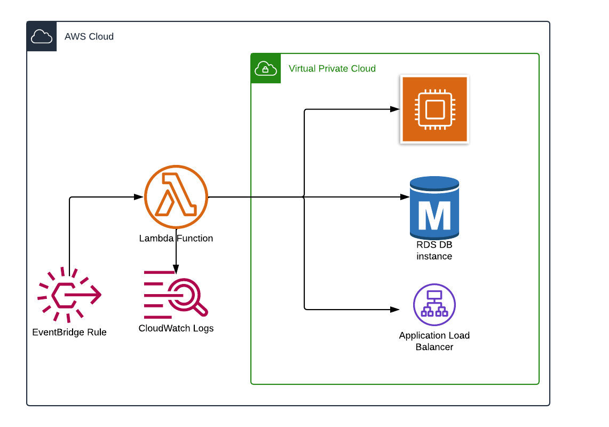

# Find My AWS Idle Resources.
With the flexible and extensive offerings of Amazon Web Services (AWS), it's easy to spin up resources when required. However, it's equally important to monitor and shut down idle resources that are no longer in use. And as a beginner we always make mistakes by spinning the resource but not stopping when it is idle.
This repo aims to find idle RDS instance, ELB and also running EC2 instance.
**Please note that it is recommended to try this tutorial in test/development environment only.**

# Idle RDS
You can stop EC2 instance in test/dev enviorment when those are not in use. For example during weekends or during the night. Given function in this repo deploys:
1. Lambda function to stop EC2 instance based on filters.
2. EventBridge based on cron job.
# Idle ELB
You can stop EC2 instance in test/dev enviorment when those are not in use. For example during weekends or during the night. Given function in this repo deploys:
1. Lambda function to stop EC2 instance based on filters.
2. EventBridge based on cron job.
# EC2 instance.
You can stop EC2 instance in **test/dev enviorment** when those are not in use. For example during weekends or during the night. Lambda function in this repo deploys:
1. Lambda function to stop EC2 instance based on filters.
2. EventBridge rule based on cron job.

